# Coursework 2

 Most students will use the same repository for coursework 2. You may use this file to present the results of that
 coursework if you wish. Alternatively you can use video or audio to provide the explanations instead of writing them.

 ## Requirements definition and analysis
 ### Requirements identification methods
 - Brainstorming: Generally, brainstorming is a group discussion centred on a theme, followed by another group discussion 
   to promote group creativity and arrive at the best solution. It is well suited for Scrum, the agile methodology. In Scrum, 
   the team holds a daily meeting, which is a great time for brainstorming to set the stage for the rest of the day's activities.
   However, since people will take turns to express their opinions, and other people should listen intently to what others 
   are saying. The rest of the people may be influenced to change their minds or forget what they wanted to say, leading
   to interruptions in their own thinking.

 - Interview: According to the Scrum principle, it is designed to enable teams naturally adapt to changing conditions and
   user needs which means it is necessary to collect feedback from users to improve the product. Interviews allow the interviewer
   to ask questions and get immediate input from the interviewee by setting up an online meeting or offline face-to-face
   communication. Although interviews tend to be time-consuming, it is still one of the most common ways to elicit requirements
   especially if the interview questions are well-prepared.
   

 - Prototyping: The primary aim of prototyping is to elicit and collect user requirement. Develop an early version of the 
   web app and present it to users to check whether the web app thus far appears to be satisfactory. Because the effective
   Scrum team is usually consists of five to seven members (DRUMOND, 2021) and everyone is in different position. There may have a big
   disagreement during the brainstorming, and prototyping are usually built early in the development cycle. It is able to 
   improve team effectiveness when it complemented with brainstorming.
   

  - Final methods applied: Considering the ethics policy, interview is not applicable for the elicitation of requirments.
    Also, prototyping is also difficult to achieve because of time constraints. However, it can not be denied that these 
    two are very good methods under realistic conditions. Therefore, the final selected method will
    be brainstorming.
 
 ### Requirements specification method
 In the agile scrum methodology, product backlog items are expressed as user stories to assist project teams and product 
 owners in focusing on the requirements from the customer's perspective. A thorough User Stories can bring many benefits 
 to the software development. To start with, it can ensure team development is on the right track, which means it helps 
 clarify user requirements well at an early stage. Apart from this, User stories can strengthen the connection within the
 team through improved transparency. If the work goes wrong, the barrier will become visible to team member and therefore
 improve the team effectiveness. (Ravlani, 2017)

 There is a basic template of user stories: As a 'role', I want 'goal' so that 'benefit'. So in this case, several user 
 stories can be defined.

 ####As a web app user, I want to have my own account so that I can manage my browsing history
 Acceptance Criteria:
 1. The user account can be created
 2. The desired data can be exported locally
 3. Password requirement for the account, including length or special characters
 4. The web app can be supported by Chrome, Edge and Safari

 ####As a web app user, I want to have a forum so that I can discuss the problem and share information on it.
 Acceptance Criteria:
 1. The question on the forum should be open, anonymous questions are not allowed.
 2. There is a notification to the questioner when the feedback is provided.
 3. The forum should be checked regularly to make sure there are no offensive language or pictures.
    
 ####As a web app user, I want to obtain the location satellite graph which can be changed by some criteria so that I can compare the result easier.
 Acceptance Criteria:
 1. The location graph should respond in 3 second when the searching criteria changed.
 2. The criteria that can be selected should include important factors such as time, year, find or not found.
 3. The line chart should also perform while the location graph is coming out.
 
 ####As a web app user, I want to be able to search for background information related to the search target.
 Acceptance Criteria:
 1. The information should be detailed, including classification, weight, photo etc.
 2. This information function should be separated from the location searching.
 3. The searching result page should at least display 10 items.

 ### Prioritisation method
 The prioritisation method will be applied is MoSCow. It is based on a simple set of requirements for dividing its importance
 into 4 categorises. 
 
 ####Must have
 1. Customer account can be created
 2. Support the search of meteorite information
 3. Display the location of meteorites falling on a map
 4. Password requirement for the account, including length or special characters
 5. The web app can be supported by Chrome, Edge and Safari;
 6. Forums is required for users discussing.
 
 ####Should have
 1. The maximum loading time of the website should not exceed 3 seconds
 2. Export the desired data locally.
 3. There is a language restriction to avoid offensive sentences in the forum.

 ####Could have
 1. Provide predictions on where the meteorite will land;
 2. The web app should function at any time.
 
 ####Won't have
 1. The maintenance time should carry out at midnight;

 ### Documented and prioritised requirements
 The table is categorized based on the functional and non-functional requirements
 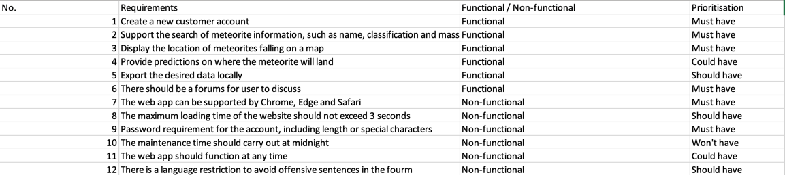

 ## Design
 ### Model
 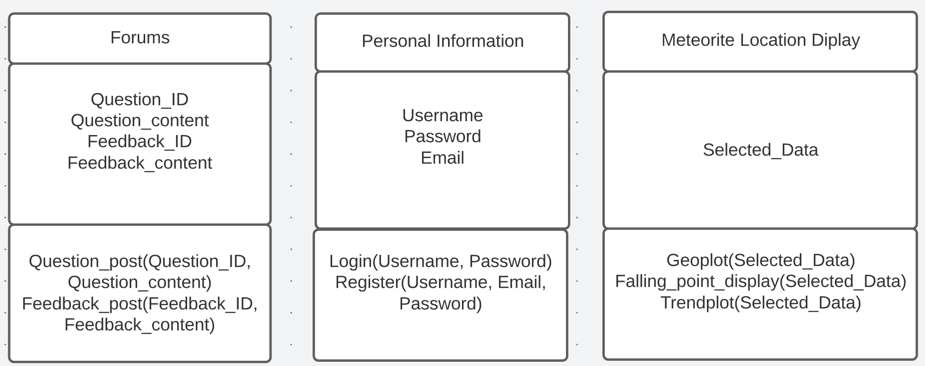
    
 ### Structure and flow of the interface
 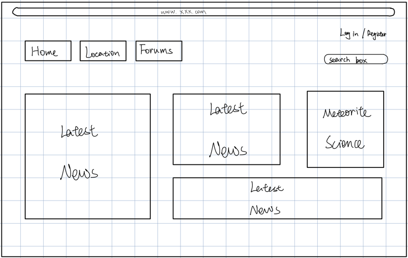
 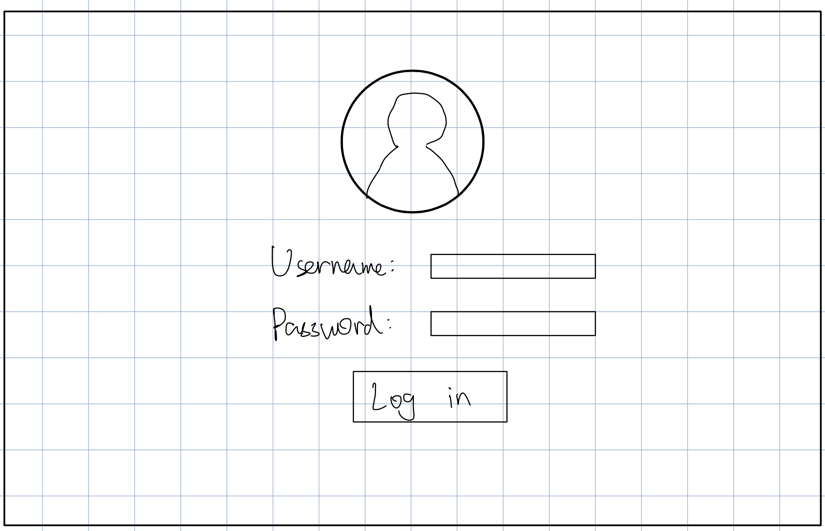
 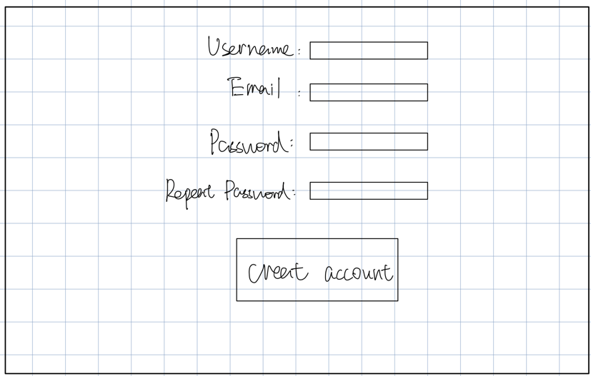
 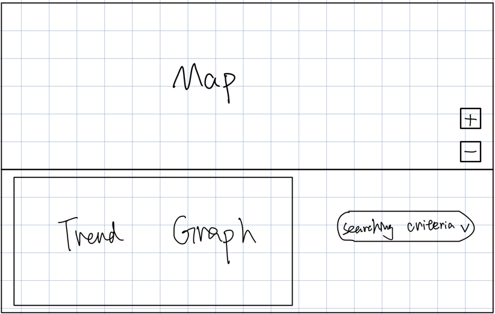
 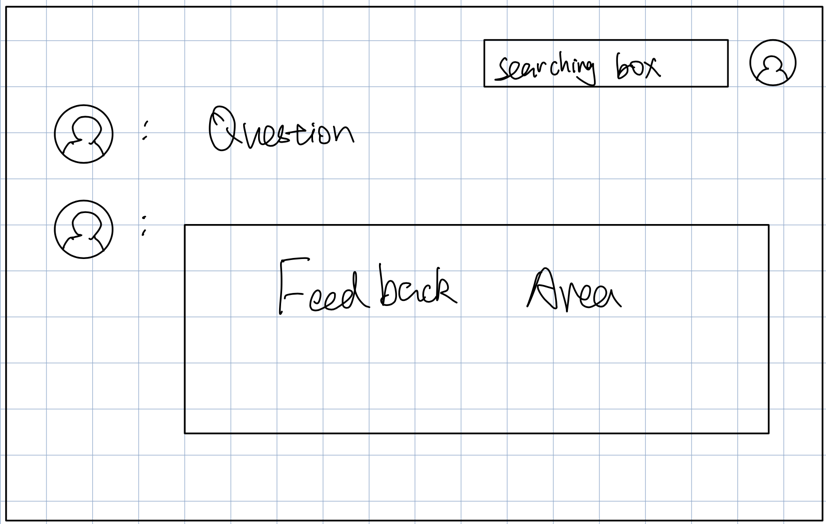
 
 ### Controller
 The webapp routes and its controllers are shown in the below table:
 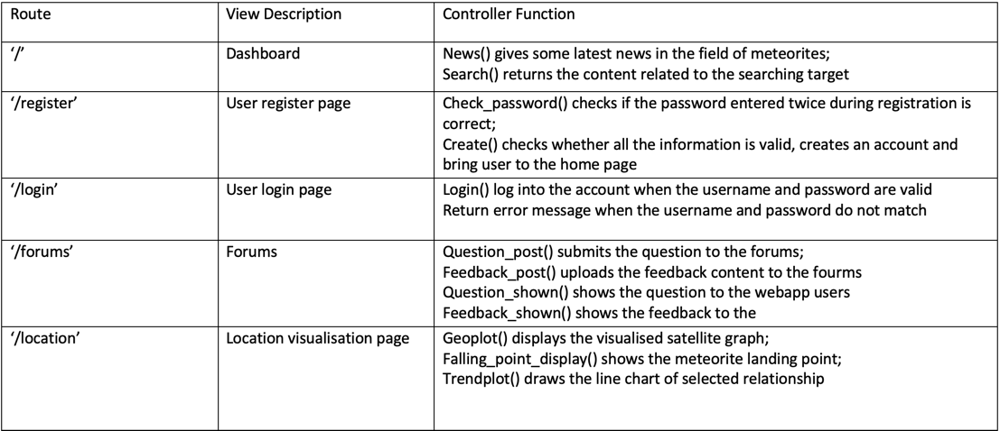

 ### Relational database design
 The ERD diagram is created by the Lucid chart which shows below:
 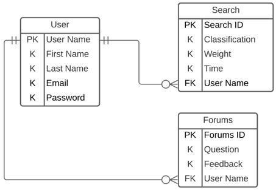
 
 Information about datatype User Name: string;   
 First Name: string;  
 Last Name: string;  
 Email: string;  
 Password: string;  
 Search ID: int;  
 Classification: string;  
 Weight: int;  
 Time: int;  
 Forums ID: int;  
 Question: string;  
 Feedback: string.

 ## Testing
 ### Choice of unit testing library
 
 ### Tests
 For the testing part, I used the user code in CW2 brief. And there is only one thing that I need to test, which is password.
 Pytest is selected as the testing methodology.

 ### Test results
 In this code, it will check whether the input password is the same as the password during registration. Pictures below shows
 the original account information.
 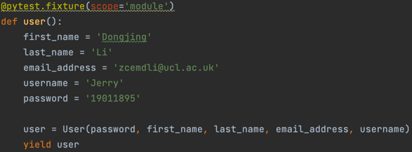

 In the testing code, we assume the input password is wrong.
 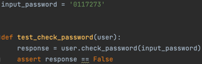

 Then, the result is given as PASSED, which means the password is wrong
 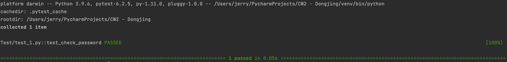

 If the input password is assumed to be true, it will return error message when the input password maintain.
 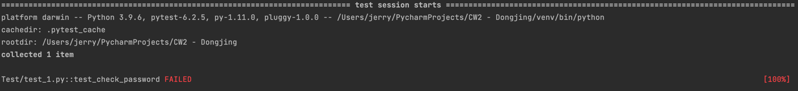

 ### Reference
 1. DRUMOND, C., 2021. Scrum - what it is, how it works, and why it's awesome. [online] Atlassian. Available at: <https://www.atlassian.com/agile/scrum> [Accessed 22 December 2021].
 2. Ravlani, K., 2017. 6 Benefits of Good User Stories - Scrum Certification Training and Agile Coaching. [online] Scrum Certification Training and Agile Coaching. Available at: <https://agileforgrowth.com/blog/userstory-benefits/> [Accessed 22 December 2021].